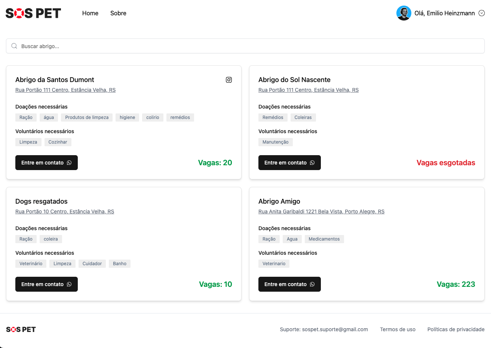

# SOS Pet

O SOS Pet é um sistema dedicado a conectar animais resgatados de enchentes com abrigos temporários disponíveis. Acreditamos que, em momentos de crise, cada vida é importante, e é nossa missão ajudar a garantir que animais em situação de risco encontrem um local seguro e acolhedor enquanto aguardam seu retorno ao lar ou um novo começo.

Com o SOS Pet, as pessoas que resgatam animais de enchentes podem rapidamente encontrar abrigos próximos com vagas disponíveis, obtendo informações cruciais, como capacidade, contato e localização. Nosso sistema permite que abrigos se cadastrem e atualizem suas informações, proporcionando uma base de dados confiável para os resgatadores.

## Rodando o projeto localmente

1. Clone o repositório
1. Instale as dependências
1. Crie um arquivo `.env` baseando se no `.env.example`
1. Assegure se de preencher todas as variáveis ambiente.
1. Suba o baco de dados: `docker-compose up -d`
1. Rode as migrations: `npx prisma migrate dev`
1. Rode o projeto com o script `dev` disponível no `package.json`
